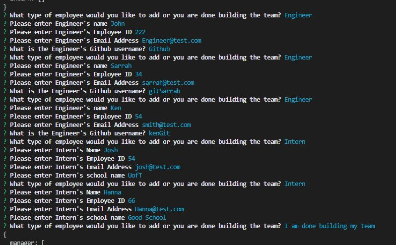
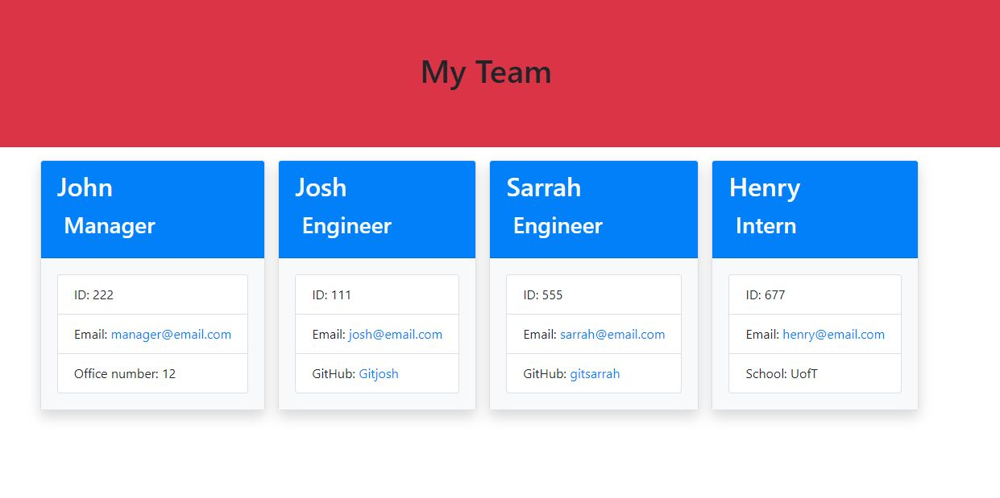

# Team-Profile-Generator

## Table of Contents

* [Project Overview](#Overview)
* [Languages Used](#Languages)
* [Libraries Used](#Libraries)
* [Installation](#Installation)

## Overview

This is a command-line application that generates an HTML file of a Team Profile for easy access to contact, IDs, Office number(for manager), Github(for engineer) and School(for Interns). Application built using Node.js and leveraging the Inquirer and Jest packages from NPM. Bootstrap are linked to style the HTML file without requiring an accompanying stylesheet.

## Languages

* JavaScript (Node.js)
* HTML

## Libraries

* [Inquirer](https://www.npmjs.com/package/inquirer)
* [Jest](https://www.npmjs.com/package/jest)
* [Bootstrap](https://getbootstrap.com/)

## Installation

Node.js is required to use this application. Once cloned/downloaded from GitHub, run command "npm i" in command line to install Inquirer and Jest packages automatically.

## Walkthrough

* [Video](https://drive.google.com/file/d/1QRqPMokp29IGylsP-1TNO8VXF0hsDFO3/view)

## Licence

[View the full license](./LICENSE).

Permission is hereby granted, free of charge, to any person obtaining a copy
of this software and associated documentation files (the "Software"), to deal
in the Software without restriction, including without limitation the rights
to use, copy, modify, merge, publish, distribute, sublicense, and/or sell
copies of the Software, and to permit persons to whom the Software is
furnished to do so, subject to the following conditions.

## Screenshots

